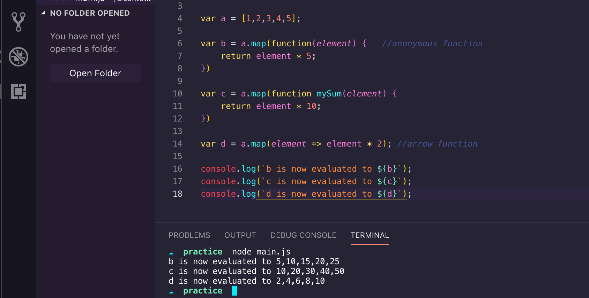
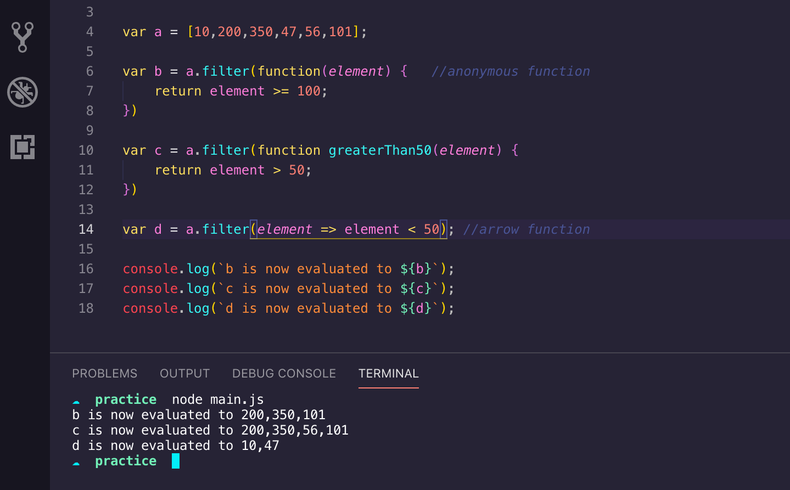

## Map and Filter

___

### <strong><em>.Map() Method</em></strong>
The JavaScript Map method iterates over every element in an array and returns a new array with the result. The `.map()` and `.forEach()` methods appear to have the same functionality; the key difference is `.map()` ability to return a new a new array. 

<strong>Syntax</strong>

The textbook syntax for the `.map()` method is `array.map(callbackFunction(currentValue, index, arr), thisValue)`.

Let's take each element by itself:
- <em>array</em> - any JavaScript array, i.e. `let myArr = [1,2,3,4,5]` 
- <em>map()</em> - the method being called on <em>myArr</em>
- <em>callbackFunction</em> - a function, either name, anonymous, or arrow, that will iterate over each item in <em>myArr</em>
- <em>index</em> -  (<strong>OPTIONAL</strong>) the index of the element in the array being processed 
- <em>arr</em> -  (<strong>OPTIONAL</strong>) the array the map method is being called on
- <em>thisValue</em> -  (<strong>OPTIONAL</strong>) value to use for `this` when executing the callback (we'll get to `this` at a later post)

As I said, the above syntax is "textbook." Below are three simple ways to utilize the `.map()` method. 

- `var b` utilizes an anonymous function
- `var c` utilizes a named function
- `var d` utilizes an arrow function

The `.map()` method does not mutate the original array. In the code above, `a` still evaluates to `[1,2,3,4,5]`. If you are not using the new array or if you are not returning any values from the callback, `.forEach` is probably the better option to use.

***
### <strong><em>.Filter() Method</em></strong>

The `.filter()` method, like `.map()`, returns a new array from the criteria passed to each item of the original array. `Filter` also uses a callback function. The best way for me to process how the callback function in `.filter()` works is, the callback function is criteria that each item of the array is checked against. If the item evaluates to true, that item is "filtered" into the new array.

<strong>Syntax</strong>

The syntax for the `.filter()` method is the same as `.map()`.

`array.filter(callbackFunction(currentValue, index, arr), thisValue)`.

- <em>array</em> - any JavaScript array, i.e. `let myArr = [1,2,3,4,5]` 
- <em>filter()</em> - the method being called on <em>myArr</em>
- <em>callbackFunction</em> - a function, either name, anonymous, or arrow, that will iterate over each item in <em>myArr</em>
- <em>index</em> -  (<strong>OPTIONAL</strong>) the index of the element in the array being processed 
- <em>arr</em> -  (<strong>OPTIONAL</strong>) the array the map method is being called on
- <em>thisValue</em> -  (<strong>OPTIONAL</strong>) value to use for `this` when executing the callback (we'll get to `this` at a later post)

Again, below are different examples utilizing the `.filter()` method:

One thing to note, as I said, `filter` returns a new array EVEN IF no items in the original array meet the criteria. If no items pass, an empty array is returned.

Below is an example in which `Filter` could be used in a real life example:

Here, an array of cities is listed (even though this is a short array, the concept can be exptrapolated with larger Fetch requests). Next is a function that takes an array and search criteria as arguements and returns a filtered array based on the `search` parameter. In this example, the `cities` array is being passed, and being asked to return all cities in that array that contain the letter "a".

***

There is another method that is typically paired when talking about `map` and `filter` and that's `reduce`. However, there's a lot to the `reduce` method and I think it deserves it's own post.

With that, I hope someone finds this tutorial helpful, as I certainly did. I've only been posting a short time, but I've already found myself coming back to my post on destructuring to keep it fresh in my mind. 

As always, happy coding!